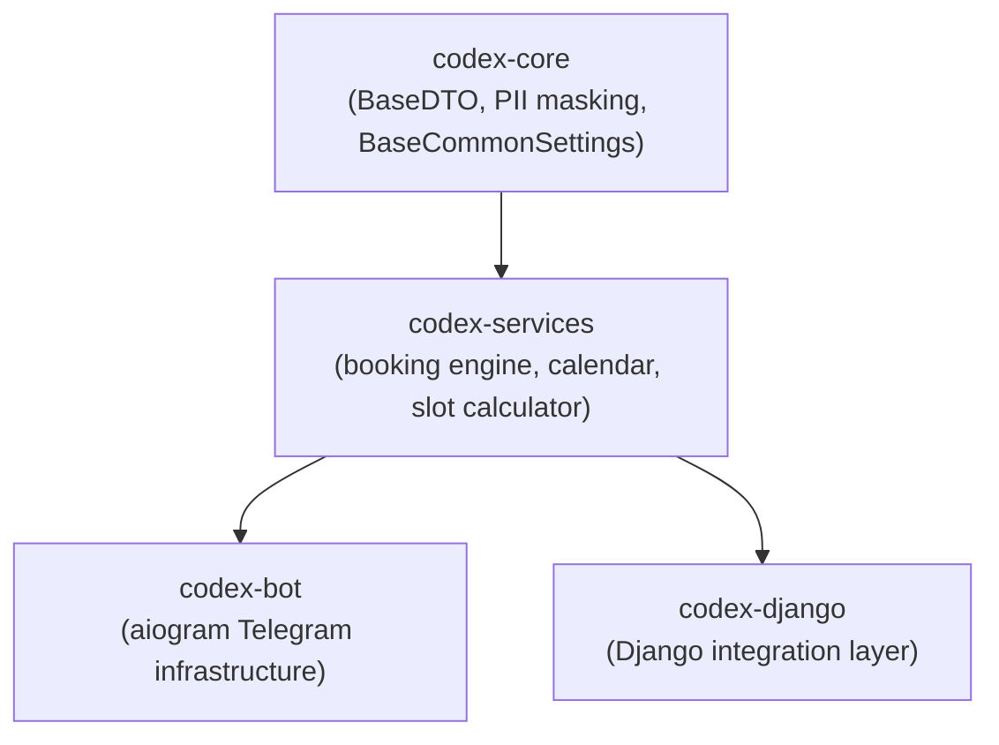

<!-- Type: CONCEPT -->

# Architecture Overview

`codex-services` is the business logic layer of the Codex ecosystem.
It provides pure-Python, framework-agnostic engines for booking, scheduling, and calendar workflows —
no ORM, no HTTP, no side effects. Drop into any Python project or wire into codex-bot / codex-django.

---

## Ecosystem Position



`codex-services` depends only on `codex-core` (and optionally `holidays`).
It has no knowledge of HTTP, databases, or message brokers.

---

## Modules

| Module | Import path | Purpose |
| :--- | :--- | :--- |
| Booking Engine | `codex_services.booking.slot_master` | Recursive chain-finder for multi-service bookings with scoring and waitlist |
| Slot Calculator | `codex_services.booking._shared` | Low-level datetime arithmetic — windows, gaps, busy interval merging |
| Calendar Engine | `codex_services.calendar` | Calendar grid generator for UI rendering with holiday awareness |

---

## Core Design Invariants

### Immutable Data Model

All DTOs inherit `BaseDTO` from `codex-core`, which enforces `frozen=True` via Pydantic `ConfigDict`.
Objects are never mutated after creation. To derive a modified copy:

```python
updated = original.model_copy(update={"score": 9.5})
```

### GDPR-Safe Logging

Every DTO's `__repr__` exposes only IDs and timestamps — never names, notes, phone numbers, or other PII.

```
<SingleServiceSolution svc=haircut res=master_1 start=10:00>
```

This is intentional and documented in the source. Safe to log at DEBUG level.

### Protocol-Driven Provider Interfaces

The engine never touches a database directly.
External data is injected via runtime-checkable `Protocol` interfaces defined in `booking._shared.interfaces`:

| Protocol | Responsibility |
| :--- | :--- |
| `AvailabilityProvider` | Build `MasterAvailability` objects from ORM/cache |
| `ScheduleProvider` | Query working hours and break intervals |
| `BusySlotsProvider` | Fetch already-booked time intervals |

Implement these in your Django/SQLAlchemy layer and pass the results to the engine.
The engine itself never imports your ORM models.

### Stateless Engines

`ChainFinder`, `BookingScorer`, and `CalendarEngine` carry no request-scoped state.
Instantiate once, reuse across requests without locks or resets.
