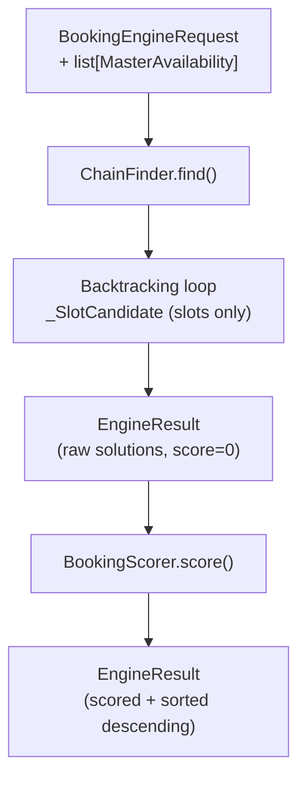

<!-- Type: CONCEPT -->

# Booking Engine Architecture

## The Problem

Scheduling N sequential services across M available resources with conflict detection.

Example: a client books a haircut (60 min, any of 3 stylists) followed by a color treatment
(90 min, only colorist-specialist). The engine must find all valid combinations
for a given date, respecting each resource's free windows, buffers, and existing appointments.

---

## Components

| Component | Role |
| :--- | :--- |
| `ChainFinder` | Recursive backtracking search — finds all valid slot chains |
| `BookingScorer` | Post-search ranking — scores and re-sorts solutions without touching the search |
| `SlotCalculator` | Low-level arithmetic — splits windows, merges busy intervals, aligns to grid |

Scoring is **fully separated** from search. `ChainFinder` returns raw solutions; `BookingScorer`
evaluates them independently. Changing scoring weights never affects which slots are found.

---

## Data Flow



For multi-day searches (`find_nearest`), `ChainFinder` calls a user-supplied
`get_availability_for_date` callable for each candidate date until solutions are found
or `search_days` is exhausted.

---

## BookingMode

| Mode | When to use |
| :--- | :--- |
| `SINGLE_DAY` | All services on one calendar day. Default. |
| `MULTI_DAY` | Services split across different days. *(Planned — not yet implemented.)* |
| `MASTER_LOCKED` | Client is on a specific resource's personal page; only that resource is considered. |

---

## Provider Interfaces

The engine accepts plain `MasterAvailability` objects.
Build them from your ORM using the provider interfaces:

```python
class MyAvailabilityProvider:
    def build_masters_availability(
        self, master_ids: list[str], target_date: date, ...
    ) -> dict[str, MasterAvailability]:
        # query DB, merge schedules, subtract busy slots
        ...
```

`AvailabilityProvider` (single day) and `build_availability_batch` (date range for `find_nearest`)
are the two integration points. The engine never imports your models.

---

## Performance Design

During backtracking the engine uses lightweight `_SlotCandidate` objects decorated with `__slots__`.
No Pydantic validation happens inside the recursion.
`SingleServiceSolution` and `BookingChainSolution` (full Pydantic DTOs) are materialized
**only for the final result set**, keeping the hot path allocation-minimal.

---

<!-- TODO: extract to tasks/using_booking_engine.md -->
## Quick Start

```python
from codex_services.booking.slot_master import find_slots
from datetime import date

result = find_slots(
    request_data={
        "service_requests": [
            {"service_id": "haircut", "duration_minutes": 60, "possible_master_ids": ["m1", "m2"]},
            {"service_id": "color",   "duration_minutes": 90, "possible_master_ids": ["m2"]},
        ],
        "booking_date": str(date.today()),
    },
    resources_availability=[
        {"master_id": "m1", "free_windows": [["2024-05-15T09:00:00", "2024-05-15T18:00:00"]]},
        {"master_id": "m2", "free_windows": [["2024-05-15T09:00:00", "2024-05-15T18:00:00"]]},
    ],
)
if result["has_solutions"]:
    print(result["solutions"][0]["starts_at"])
```

---

## See Also

- [API Reference — Slot Master](../api/booking/slot_master/index.md)
- Future: `tasks/using_booking_engine.md` — step-by-step integration guide
