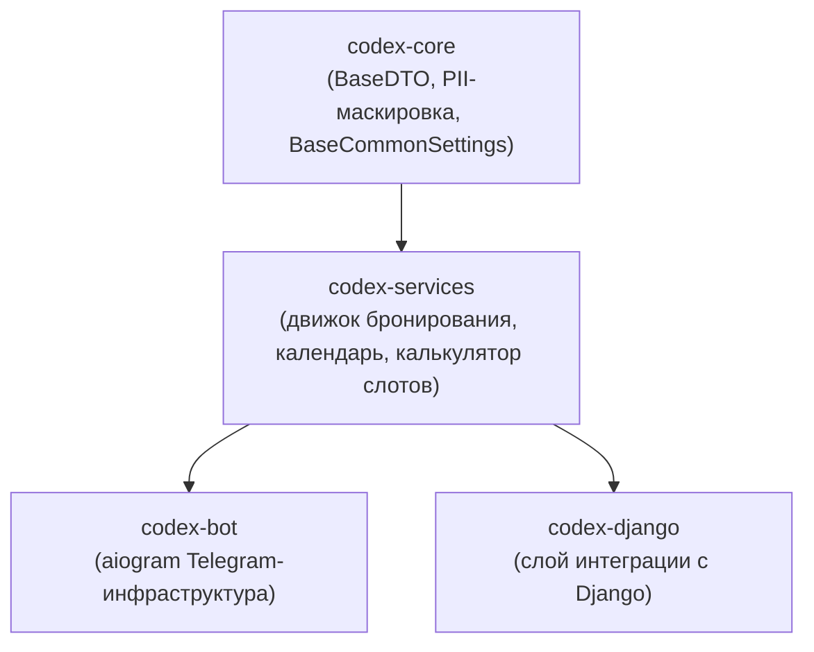

<!-- Type: CONCEPT -->

# Обзор архитектуры

`codex-services` — слой бизнес-логики экосистемы Codex.
Предоставляет чистые Python-движки для бронирования, планирования и календарных операций —
без ORM, без HTTP, без побочных эффектов. Встраивается в любой Python-проект
или подключается к codex-bot / codex-django.

---

## Место в экосистеме



`codex-services` зависит только от `codex-core` (и опционально от `holidays`).
Не знает ни про HTTP, ни про базы данных, ни про брокеры сообщений.

---

## Модули

| Модуль | Путь импорта | Назначение |
| :--- | :--- | :--- |
| Движок бронирования | `codex_services.booking.slot_master` | Рекурсивный поиск цепочки слотов для нескольких услуг со скорингом и листом ожидания |
| Калькулятор слотов | `codex_services.booking._shared` | Низкоуровневая арифметика datetime — окна, зазоры, объединение занятых интервалов |
| Движок календаря | `codex_services.calendar` | Генератор сетки календаря для UI с поддержкой праздников |

---

## Инварианты проектирования

### Иммутабельная модель данных

Все DTO наследуют `BaseDTO` из `codex-core`, который принудительно устанавливает `frozen=True`
через Pydantic `ConfigDict`. Объекты не изменяются после создания.
Для получения модифицированной копии:

```python
updated = original.model_copy(update={"score": 9.5})
```

### GDPR-безопасное логирование

`__repr__` каждого DTO раскрывает только идентификаторы и временные метки —
никаких имён, заметок, телефонов или иных персональных данных.

```
<SingleServiceSolution svc=haircut res=master_1 start=10:00>
```

Это намеренное решение, задокументированное в коде. Безопасно логировать на уровне DEBUG.

### Провайдеры через Protocol-интерфейсы

Движок никогда не обращается к базе данных напрямую.
Внешние данные передаются через runtime-checkable `Protocol`-интерфейсы из `booking._shared.interfaces`:

| Protocol | Ответственность |
| :--- | :--- |
| `AvailabilityProvider` | Построить `MasterAvailability` из ORM/кэша |
| `ScheduleProvider` | Получить рабочие часы и перерывы |
| `BusySlotsProvider` | Получить уже забронированные интервалы |

Реализуйте их в своём Django/SQLAlchemy-слое и передайте результаты в движок.
Движок никогда не импортирует ваши ORM-модели.

### Stateless-движки

`ChainFinder`, `BookingScorer` и `CalendarEngine` не хранят состояние запроса.
Создайте один раз, переиспользуйте между запросами без блокировок и сбросов.
