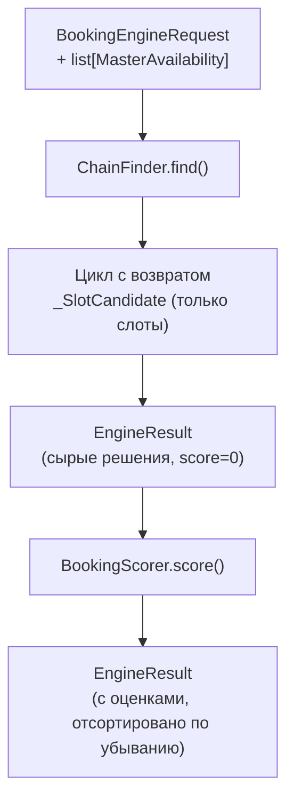

<!-- Type: CONCEPT -->

# Архитектура движка бронирования

## Задача

Расписание N последовательных услуг по M доступным ресурсам с обнаружением конфликтов.

Пример: клиент бронирует стрижку (60 мин, любой из 3 стилистов) + окрашивание
(90 мин, только колорист-специалист). Движок должен найти все допустимые комбинации
на заданную дату с учётом свободных окон каждого ресурса, буферов и существующих записей.

---

## Компоненты

| Компонент | Роль |
| :--- | :--- |
| `ChainFinder` | Рекурсивный поиск с возвратом — находит все допустимые цепочки слотов |
| `BookingScorer` | Ранжирование после поиска — оценивает и пересортировывает решения, не затрагивая сам поиск |
| `SlotCalculator` | Низкоуровневая арифметика — разбивка окон, объединение занятых интервалов, выравнивание по сетке |

Скоринг **полностью отделён** от поиска. `ChainFinder` возвращает «сырые» решения;
`BookingScorer` оценивает их независимо. Изменение весов скоринга никак не влияет на найденные слоты.

---

## Поток данных



При поиске на несколько дней (`find_nearest`) `ChainFinder` вызывает переданный
пользователем `get_availability_for_date` для каждой кандидатной даты,
пока не найдёт решения или не исчерпает `search_days`.

---

## BookingMode

| Режим | Когда использовать |
| :--- | :--- |
| `SINGLE_DAY` | Все услуги в один календарный день. По умолчанию. |
| `MULTI_DAY` | Услуги распределены по разным дням. *(Запланировано — ещё не реализовано.)* |
| `MASTER_LOCKED` | Клиент находится на личной странице конкретного мастера; учитывается только этот ресурс. |

---

## Провайдер-интерфейсы

Движок принимает готовые объекты `MasterAvailability`.
Постройте их из своего ORM через провайдер-интерфейсы:

```python
class MyAvailabilityProvider:
    def build_masters_availability(
        self, master_ids: list[str], target_date: date, ...
    ) -> dict[str, MasterAvailability]:
        # запрос к БД, объединение расписаний, вычитание занятых слотов
        ...
```

`AvailabilityProvider` (один день) и `build_availability_batch` (диапазон дат для `find_nearest`) —
две точки интеграции. Движок никогда не импортирует ваши модели.

---

## Производительность

Во время поиска с возвратом движок использует лёгкие объекты `_SlotCandidate`
с атрибутом `__slots__`. Pydantic-валидация внутри рекурсии не выполняется.
`SingleServiceSolution` и `BookingChainSolution` (полные Pydantic DTO) создаются
**только для итогового набора решений**, минимизируя аллокации на горячем пути.

---

<!-- TODO: extract to tasks/using_booking_engine.md -->
## Быстрый старт

```python
from codex_services.booking.slot_master import find_slots
from datetime import date

result = find_slots(
    request_data={
        "service_requests": [
            {"service_id": "haircut", "duration_minutes": 60, "possible_master_ids": ["m1", "m2"]},
            {"service_id": "color",   "duration_minutes": 90, "possible_master_ids": ["m2"]},
        ],
        "booking_date": str(date.today()),
    },
    resources_availability=[
        {"master_id": "m1", "free_windows": [["2024-05-15T09:00:00", "2024-05-15T18:00:00"]]},
        {"master_id": "m2", "free_windows": [["2024-05-15T09:00:00", "2024-05-15T18:00:00"]]},
    ],
)
if result["has_solutions"]:
    print(result["solutions"][0]["starts_at"])
```

---

## Смотри также

- [API Reference — Slot Master](../../en/api/booking/slot_master/index.md)
- Будущее: `tasks/using_booking_engine.md` — пошаговое руководство по интеграции
